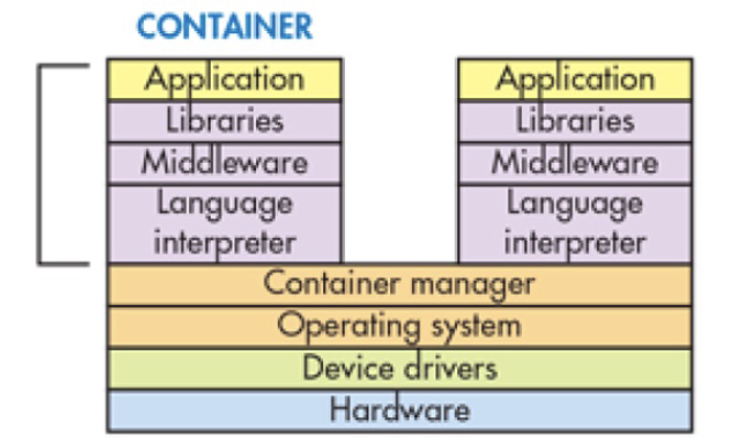
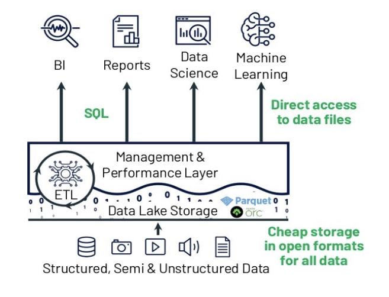
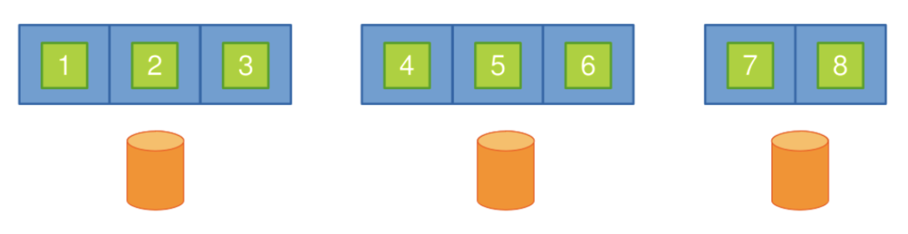
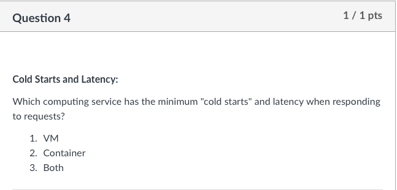

# Data Centers and Cloud

- Moore's law: he predicted that we will double the number of transistors we can have on a chip every two years

  - problem: clock speed has not gotten any faster, but we keep getting more transistors &rightarrow; what to do with all this extra transistors 
  - we make multicore processors (though there's no significant improvement of ratio of code that can be executed in parallel is low)
  - <u>single computers (even with multicore) is no longer enough</u> &rightarrow; we have too much data and there's just not enough storage and computation capacity
    - solution: data centers

- data centers

  - they are a network of computers working together

  - data center network 

     

    - these racks of servers communicate and work together through the wires

  - availability: data centers have very struct standard for reliability and availability (99+% up time a year)

- <u>**cloud computing**</u>

  - definition: it's a model for enabling ubiquitous, convenient, on-demand network access to a shared pool of configurable computing resources (ex. networks, servers, storage, etc) that can be rapidly provisioned and released with minimal involvement by the user
  - <u>simply</u>: a service where you can easily access and use computer resources like servers and storage over the internet; you can get what you need quickly and don't have to worry much about setting it up yourself
  - attributes:
    - <u>on-demand self-service</u>: users are able to provision resources without requiring human-interaction (i.e user can do it through a web portal - no need to call anyone)
    - <u>broad network access</u>: cloud computing resources are accessible over the network; so they support plethora of client platforms (i.e phones, workstations, laptops, etc)
    - <u>resources pooling</u>: can provide service to multiple different customers from the same physical resources - do so by securely separating the resources on logical level (partitioning)
      - location independence: client doesn't have any control over the exact location of the resources
    - <u>**rapid elasticity**</u>: ability to scale resources both up and down as needed 
      - (to the customer, the cloud appears to be infinite and they can purchase as much or as little computing power as they need)
    - <u>measured service</u>: resources usage are monitored, measured and reported (billed) transparently based on utilization 

- cloud service models

  - **IaaS (Infrastructure as a Service):**
    - provides virtualized infrastructure (computing, storage, networking) <u>**only**</u>
    - users manage the operating system, applications, and data &rightarrow; more control but more management
    - example: EC2 instances
  - **PaaS (Platform as a Service):**
    - <u>provides a platform for developing, deploying, and managing applications</u>
    - users focus on building and deploying apps, while the platform manages infrastructure
    - offers a balance between control and ease of use
    - example: Heroku
  - **SaaS (Software as a Service):**
    - delivers fully functional software applications over the internet
    - users access software without worrying about infrastructure or maintenance
    - offers the least control but is the easiest to use
    - ex. Dropbox, Gmail - you just go there and you use their platform for what its intended for (store files, send emails) and you just pay as you use it
  
- quick comparison of the cloud computing services we'll cover

  1. **Bare Metal:**
     - Physical servers with no virtualization.
     - High performance and dedicated hardware.
     - Typically more maintenance and longer setup time.
  2. **Virtual Machines (VMs):**
     - Virtualized servers running on a physical machine.
     - Offers isolation and flexibility.
     - Requires more resources due to virtualization overhead.
  3. **Containerization:**
     - Lightweight, isolated application packages.
     - Efficient resource usage and fast deployment.
     - Less isolation compared to VMs.
  4. **Serverless:**
     - Code-focused, no server management.
     - Automatically scales based on demand.
     - Event-driven and pay-as-you-go pricing.

  - in terms of launch/deploy time: <u>serverless < containers < VM < bare metal</u> (smaller is good)

## Serverless

- model where the <u>**cloud provider allocates machine resources on demand, taking care of servers and management on behalf of the customer**</u>

  - (this is the official definition of serverless)

- AWS Lambda Functions that we work with are also serverless

  - they're called called **Function-as-a-Service (FaaS)**
    - so all the developer has to do is write some code (a function) - deploy that and that's it
  - natural fit for FaaS is event-driven architecture - run some code in response to some event and not have to worry about the underlying servers/infra

- in terms of cost, if you only have a function to run &rightarrow; serverless is the best as it is very scalable and you only scale when you need it

  - as opposed to maybe in a VM where you have to pre-allocate

  > Example: Alexa
  >
  > - <u>event-driven architecture</u>: runs code in response to an event (here: when someone says "Hey Alexa")
  >   - example of events: change in data state, request to an endpoint, change in resources state, or calling serverless-function from somewhere else
  > - note: you are responsible for emitting and observing the event

- serverless execution environment 

   

  - you develop code, cloud provider will containerize your code, and deploy it in the cloud
    - **so serverless does leverage some container tech**
  - each function needs its own container
  - function runs inside an container
    - single OS runs multiple containers
    - isolation ensures that only processes in containers are visible
    - has its own file sytem `/tmp` (not visible to other containers)
    - languages: C#, Node.js, Java, Python, and more
  - a container handles a single function/event at a time
  - ==containers are stateless== (following calls will not be remembered)
    - if you wanted to persist states you need to store it outside of the containers (DB, etc)

- commercial serverless platforms

  - Amazon’s AWS Lambda
  - Microsoft Azure Functions

- scaling issues with traditional databases 

  - lambda function works with a lot of microservices (S3 buckets, DB, etc)

    - these other modules need to be scale-able as well
  - basically: traditional DB are not as rapidly scalable as serverless functions &rightarrow; serverless can allocate more resources very quickly while DB cannot
  - ideally: DB should also be scalable in terms of Read/Write and you pay as you go too
    - note: you can have serverless DBs as well that scales as you need 

- serverless security 

  - Q: Is my API open to the world?
    - fix: ensure proper access control
  - Q: Can it be abused without authentication
    - fix: check for authentication and authorization
  - Q: Is my data encrypted and protected?
    - fix: use data encryption
  - Q: How to manage my secret keys?
    - fix: use secret managers like AWS Secret Manager
  - **key**: a lot of the above has to do with access, authorization and privacy 
    - so basically use proper auth, access control, as well as encrypt data

- ==drawbacks==

  - what if my function has dependencies?
    - scalability of the entire program depends on the scalability of the dependencies
  - what about if my application needs to run 24/7
    - spin up takes a bit of time
    - not so good when you need to run it 24/7 (functions spin up every time you call it)
  - solution: use containers

## Containers

- Container is a method of OS virtualization that can be used to run an application and its dependencies in resource-isolated processes

  - lightweight alternative to VM (does not need any Guest OS to run hypervisor &rightarrow; make use of host operating system)
  - containers are cheap and so fast to create and destroy

- containers provide virtualization at the application layer

  - they are standard executable components that combine application source code with all the dependencies required to <u>run the code in any environment</u>

  - they create a a portable environment

     

- what's a dependency? Anything needed to run an application

  - example: libraries, system tools, config files, settings, package manager, etc ...

- isolation: <u>processes executing in a container are isolated from processes running on the host OS or in other containers</u> &rightarrow; enabled by 2 components - LXC and CGroups

  - <u>**LXC (Linux Container)**</u>: ==provides separate namespaces for containers==
    - namespace is a set of signs that are used to identify and refer to objects of various kinds
    - they have access to different memory &rightarrow; this is what gives them isolation
  - <u>**Control Groups (CGroups)**</u> are used to implement resources auditing and limiting 
  - (note: see security concerns)

> Use Case: Docker
>
> - Docker is the most popular implementation of a container &rightarrow; is a virtualization software managing the containers
> - Docker enables developers to package applications into containers
> - important parts 
>
>   - Docker images: blueprints of our application that forms basis of containers (has all dependencies and software required)
>   - Docker containers: they're created from images and run the actual application
>     - so it's the actual containerization that we've been talking about 
>     - (in a sense: a docker image is a template, and a container is a copy of that template)
> - steps:
>   1. Create Dockerfile (specify which function to run and stuff)
>   2. Create `requirement.txt` file
>   3. Create docker image (`docker build`)
>      - you can run a Docker image by doing `docker run`
>   4. Tag and push it to Docker hub
>      - another machine can pull this then `docker run`
> - Docker hub: it's like a Github that you can push and pull your images and version them

- container vs VM

   

- advantage of containers

  - easy to create and deploy
    - good for CI/CD
  - provide visibility into how applications are running, making it easier to spot issues and fix them
  - <u>cloud and OS distribution portability</u> - it theoretically should be able to run on any OS on any cloud providers
  - provide resources isolation
  - resources utilization - containers make the most efficient use of resources

- container challenges

  - containers share the kernel of host OS - this means <u>less isolation than VM</u>
    - if kernel was subjected to security attack or dies - all of containers are either exposed or die
  - managing containers at scale is hard to do 
    - if you have a lot of containers - managing all of them is a headache
    - fix: user container orchestration platform 

- container orchestration tasks

  - provision and deploy containers
  - helps with scaling up or removing containers to spread application load evenly 
  - move containers from one host to another (in case of resource-shortage, or if host dies)
  - allocation of resources between containers
  - load-balancing (distribute traffic across containers)	
  - example: Kubernetes

- **container security concerns**

  - shared kernel: multiple containers share the same host operating system kernel
    - if kernel is compromised - so are the containers running on top of it
  - attack surfaces: all of the following can be exploited 
    - <u>container image security</u>: basically - a "bad" image could potentially take over your system if you're not careful
      - fix: do image scanning and vulnerability analysis (to scan for bugs in the image software)
        - image source  stick to official images 
        - image signing and verification  use crypto signatures and verify image signature before deploying in production
        - image life cycle  regularly update base images
    - runtime security: containers linux namespaces and CGroups to isolate containers &rightarrow; <u>if the kernel goes down, so do all the containers</u>
      - fix: real time monitoring to detect and responding to security incidents during container runtime
        - use container security solutions to monitor and analyze container behaviour
        - implement intrusion detection systems (IDS) to identify suspicious activities 	
    - orchestration security: the orchestration tool is a an essential part of containers - but it's also an additional attack surface &rightarrow; if master node was hijacked, attacker would be able to take over the entire cluster
      - fix: have additional security measures around orchestration tools
        - node security: use string auth for node access and employ node firewalls and IDS 

        - api security: ensure that API server only accessible over secured channels 

        - secret management: utilize orchestration-specific secret management solutions (i.e Kubernetes Secrets) to protect and distribute secrets

## Virtualization

- virtualization: extend or replace an existing interface to mimic the behaviour of another system

  - handle platform diversity by running apps on VM

- a Virtual Machine (VM) is implemented by adding a layer of software to a real machine so as to support the desired VM’s architecture 

  - layer of software is often referred to as virtual machine monitor (VMM)
  - early VMMs are implemented in firmware 
  - today, VMs are often implemented as a co-designed firmware-software layer, <u>referred to as the hypervisor</u>

- definitions 

  - hypervisor (or VMM) is a software layer that allows several VM to run on a <u>physical machine</u>
  - physical OS and hardware is called <u>host</u>
  - the VM OS and applications are called <u>Guest</u>

- types of hypervisors

   

  - type 1 (bare-metal): loaded directly on hardware
    - no notion of a "host" OS
    - mostly used in servers or data centers
  - type 2 (hosted): loaded in an OS running on hardware
    - the usual one we use
    - ex. you have your OS - you install a hypervisor (VM Box) and then run some more VM

- types of virtualization

  - full virtualization: try to use all of the resources of the hardware
  - para virtualization: try to use a part of the resources of the hardware

- partitioning

  - important part to enable virtualization 
  - a partition is given a subset of the resources available on the system
    - do this so that multiple applications can simultaneously use the available resources of the system
  - partitioning can be achieved
    - in-space (physical partitioning)
    - in-time (logical partition)

- physical partitioning (in-space)

   

  - pre-allocate resources to a partition
    - number of partitions is limited to the number of available physical processors

    - <u>it's fixed after you've partitioned them</u>
  - <u>two partitions cannot share resources</u> - they are very isolated 
  - advantages:
    -  failure isolation: in event of failure - only part of the physical system that has the failing partition will be affected

    -  better security isolation: each partition is protected from denial-of-service attacks by other partitions
       -  i.e a partition can't hog all the resources so that our partition can't run anything

    -  better ability to meet system-level objectives: based on specification of the application - you can allocate exactly that much resources needed
       -  i.e the program need 16 GB ram and 1 TB disk - we can provide exactly that

    -  easier management of resources: no need for sophisticated algorithms for scheduling and management of resources because it's fixed
  - disadvantage
    -  worse system utilization: it's often the case that each of the physical partitions is under utilized 
       -  resources are up and running all the time (even when there's not enough traffic)
    -  worse load balancing: dynamic workload balancing becomes difficult 
       -  can't scale as traffic increases because it is fixed

- logical partitioning (in-time)

   

  - details: 

    - partitioning involves dividing physical resources of a computer (CPU, memory, IO devices) into isolated segments - knowns as logical partitions or LPARs

       

      - each LPAR behaves like a separate virtual computer with its own OS and application
      - an LPAR can be completely defined in a file 
      - notable advantage: using LPAR - the state of a virtual machine can be saved and moved easily, even on the fly, which is referred to as VM Live Migration

  - every partition can share resources with adjacent partitions

  - more flexible but needs additional mechanism to provide safe and efficient way of sharing resources

- VM Live Migration

  - basically completely migrating a VM from one physical server to another physical server
  - VMotion: handles VM Migration among servers with shared storage
  - SVMotion: handles VM Migration among servers without storage
    - need to migrate the storage over to the new server as well
    - takes a bit longer

- VM high availability: 

  - if 15 second period elapses without receipt of "heartbeat" from the host, and the host cannot be pinged, it's declared as failed
  - in event of host failure, VM that lived on the dead host is rebooted on another host (called "failed over")

- VM fault tolerance

  - basically: there's a replica of VM running on different server so that it can take over in the case of failure immediately 
  - when a secondary VM is called upon to replace its Primary VM counterpart, the secondary VM immediately takes over the Primary VM's role with the entire state of the VM preserved

- VM elasticity: types of scaling

   

  - vertical scaling: scaling the VM resources such as computing power, disk space, memory, network capacity
    - you can scale up or down as needed
    - more expensive than scaling out
  - horizontal scaling: adding or removing VM (of the same specs) depending on traffic demand
    - you can add as many VM as you need for a heavy computing job and terminate them when they are no longer needed
    - more challenging for fault tolerance and software development (distributed systems is hard)
  - when to choose what
    - when instance size is not big enough to handle common processing tasks &rightarrow; use vertical scaling (computation related)
    - when VM faces more request than it can handle &rightarrow; horizontal scaling (traffic related)

- example of virtualization: virtualized DB servers

  - it used to be that we host 1 database server using a machine

  - in data center, we can use virtualization to host multiple databases on 1 machine across many machines

     

- advantages of server virtualization

  - cost: less physical servers, less server space, less energy cost, less maintenance 
  - efficient administration: managing many VMs is easier than managing many servers
  - growth and scalability: adding more virtual machines or resources to a virtualized environment can be done without major disruptions and upgrading the host server can enhance performance for all VMs 
  - **<u>security</u>**: single server security maintenance and hypervisor often provides security benefits

- disadvantages of server virtualization

  - slow performance: virtualization introduces overhead 
    - high stress on single machine, longer processing times, more network bottleneck
  - single point of failure: many servers on 1 host machine and hardware/software failures can be critical

### Example: EC2 Instances

1. Choose name and tag
   - tag is a label you can assign to an instance
   - it consists of a key and an optional value
   - by default, the name is made into a tag
   - used for filtering and managment
2. Choosing AMI (Amazon Machine Image)
   - they are basically template for the instance
   - have things like OS and system architecture (32 vs 64 bits), etc
   - ==cannot be changed after==
3. Choose instance type
   - basically specify the hardware associated with the instace
   - things like memory, disk space, processing power, etc
   - ==can be changed after the fact== (vertical scaling)
4. Key Pairs
   - key pair consists of
     - public key that AWS store
     - private key that you store
   - you can specify an existing pair or create new ones
     - cannot add new key pair after creation
   - need the key to SSH into the server
5. Network Settings
   - VPC (virtual private cloud)

     - kind of isolated environment on the cloud that can you can put your instance there to be more secure (no access to anything else in the internet)
     - you can set up the instance then put it under a VPC (under network setting)
   - Security Groups
     - virtual firewall for your instances
     - controls network access
       - allow certain in-bound requests, allow certain out-bound requests and block others, only accept secure HTTP, etc
       - can be updated at any time
     - exists outside the instance's OS 
6. Configure Storage
   - types: 
     - root volume (ephemeral - not persistent, cheap)
     - EBS - block (external) storage (persistent, a bit more expensive, has a lot of storage capabilities)
7. Access control
   - specify which IAM roles can use the instance

- some instance types
  - on-demand: pay as you go
  - spot: basically say if your current bill is under a certain threshold, run it, if not and don't run
  - reserved instances: customers can rent EC2 instances for 1 to 3 years to reduce cost
  - dedicated hosts: most expensive - you just want some specific resources for yourself and always have access

## Computing Service Comparison

- overview of the different services

   

- at the beginning we have 

   

- reasons to move from one cloud computing service to another

   

  - i.e if you have an application with complex dependencies  - you should move from serverless to containers
  - i.e you should move from container to VM if you're concerned about isolation/security 

# Big Data and Cloud Storage System

## Big Data Intro 

- definition: basically just a huge amount of data that's has outpaced our capability to start, process, analyze and understand &rightarrow; can't fit into 1 computer
- big data attributes - the 4 V's

  - volume: data size
    - more data than fits in a computer's RAM
    - more data than fits on a single hard drive
    - i.e facebook's 2+ billion users
  - velocity: data generation rate
    - rapid generation of new data
    - ex. nearly 200 million emails are sent each minute of each day
    - ex. nearly 5 billion videos are watched on YouTube every day
  - variety: data heterogeneity
    - data in many formats
    - ex. videos, photos, audio, GPS coordinates
  - veracity: data quality
    - data relability and trustworthiness
    - important to make informed decisions or draw meaningful insights
    - data quality processes, data validation procedures, and data governance practices are required to maintain and improve the accuracy and trustworthiness of their data

## Distributed File System (DFS)

- file system
  - controls how data is stored in and retrieved from disk (specify hierarchy and permission and things like that)
  - traditional file systems are not well-designed for large-scale data processing systems
    - efficiency has a higher priority than other features (i.e directory service)
  - massive size of data tends to store it across multiple machines in a distributed way
    - ex. HDFS/GFS, Amazon S3
- distributed file system (DFS)

  - when data outgrows storage capacity of a single machine &rightarrow; partition data across a number of separate machines
  - DFS manage the storage across a network of machines
- DFS benefits
  - makes it easier to share data over a network 
  - user can access remote files as if they were local
- DFS component
  - <u>data state</u>: content of the files
  - <u>attribute state (metadata)</u>: the information about each file (e.g., file’s size and access control list)
  - <u>open file state</u>: includes which files are open or otherwise in use, as well as describing how files are locked
- where DFS components live
  - data and the attribute states permanently reside on the server’s local file system

    - can be copied to the client side once accessed, but stored server-side always
  - caches for recently accessed or modified information might reside in server and/or client side
  - open-file state is transitory; it changes as processes open and close files
    - so it can be find everywhere - but it's changing all the time
    - ex. when a file is first opened by a process, its open-file state is established. As operations are performed on the file (like reading, writing, or moving the read/write pointer), this state is updated &rightarrow; discarded when the file is close

### HDFS (Hadoop DFS)

- appears as a single disk

  - you can create a cluster of machines that act as storage
  - <u>each node is a single linux-base machine</u>

- <u>data locality</u>: concept of storing and processing data in close proximity

  - (ideally on the same physical node or within the same rack of nodes in a Hadoop cluster)
  - when a job (like a MapReduce job) is executed, HDFS tries to move the computation closer to where the data resides, rather than moving large data sets across the network
  - reduces network congestion and increases the overall speed of data processing

- <u>fault tolerant</u>: can handle disk crashes, machine crashes

- files and blocks

  	

  - files are split into blocks 
    - these "chunks" of data maybe stored in different place
    - the more you split - the harder it is to manage &rightarrow; the coarser the better
  - blocks: single unit of storage 
    - 64 mb to 128 mb
  - same block is replicated on multiple machines - default is 3
    - this is for fault tolerance

- storing a file

   

  - first file split into 3 blocks, second one into 2
  - all the blocks are replicated and then placed into different nodes 

    - you can see this reflected in the diagram but also in the metadata

- retrieving a file

   

  - the client can ask for the file and Namenode will <u>provide the info of where it's stored</u>, then client go fetch it themselves
  - note: the HDFS client **library** will take care of reading the blocks in order and reconstructing the file, to the client it's all very seamless

- HDFS Components

   

  - Namenode (aka masternode)
    - the centerpiece of an HDFS file system 
    - it manages the metadata 
      - **Namespaces**: hierarchical structure (the directory trees of folders and files)
      - **ACLs (Access Control Lists)**: define who can can access a file/folder and their permissions
      - **File to Block Mappings**: record of which blocks form a particular file
      - **Block Locations**: Namenode knows on which DataNode each block of a file is located
      - most of these are stored in memory, but some are also stored in operation logs
    - periodically communicates with each Datanode to determines block locations and asses state of the overall system (see if Datanodes have failed or not)
  - Datanodes
    - store the actual data blocks of files
    - tells Namenode what blocks it has
    - maintains data consistency (i.e make sure the block's data is not corrupted)
  - Client:
    -  interface through which external applications or users interact with the HDFS
    - interacts with the Namenode
      - to update the Namenode namespace (i.e change folder structure)
      - to retrieve block locations for writing and reading
    - interacts directly with Datanode
      - to read and write data
      - <u>**note: Namenodes does not directly write or read data**</u>	
  - note: there's a also a Secondary Namenode and a Standby Namenode
    - Secondary Namenode 
      - performs housekeeping functions for the Namenode
      - job is to take periodic "snapshots" of the system's metadata &rightarrow; helps Namenode recover faster if needed
    - Standby Namenode
      - like a "backup" for the main Namenode
      - continuously syncs with the main Namenode &rightarrow; can take over immediately without data loss in case of failure

- block size in HDFS

  - usually is 128 MB (256 in newer versions)
  - advantages
    - reduces the size of metadata stored in Namenode (bigger block size = less number of blocks)
    - thus reduces client's need to interact with Namenode

  - disadvantage
    - wasted space due to internal fragmentation (last block might have a lot of empty space because the data didn't cut up nicely)
    - ex. block size is set to 256 MB, and you store a file that is only 100 MB in size, the last block allocated to this file would have 156 MB of unused space	

- system interface 

  - not POSIX-compliant - but supports typical file system operations 
    - create, delete, open, close, read and write

  - snapshot: creates a copy of a file or a directory at low cost
  - append: allow multiple clients to append data to the same file concurrently

- HDFS read

  	

  1. client ask name node for block location (block topology)
  2. then client go ask the <u>actual data node</u> and grab the actual data

- HDFS write

   

- HDFS was designed with a single Namenode in mind

  - the Namenode has a global knowledge of the whole system
    - simplifies the design
    - the Namenode is (hopefully) never the bottleneck
  - clients never read and write data through the Namenode
    - client only requests from Namenode then talk to the Datanodes
    - further reads of the same block do not involve the Namenode (probably via caching) 

    - disadvantage: single point of failure
      - but we have back ups and other mechanisms to help with that

- <u>**Namenode Operations**</u>

  - <u>Namespace Management and Locking</u>
    - system represents its namespace as a lookup table &rightarrow; maps pathnames (like folder and file names) to the corresponding metadata
    - locking mechanism: before executing any master operation (an operation that could modify or read the namespace), the system first acquires the necessary locks to ensure data consistency and prevent conflicts
      - summary: before reading and writing to avoid race condition and conflicts &rightarrow; you need to lock
    - ex. creating multiple files (f1 and f2) in the same directory (`/home/user`)
      - each operation requires a read lock on the directory name `home/users`

      - each operation acquires a write lock on the file name `f1` and `f1`

      - the read lock on directory `/home/user` prevent its deletion

      - allows concurrent mutations the same directory

    - HDFS creates the lock
  - <u>Replica Placement</u>
    - maximize data reliability, availability and bandwidth utilization
    - replicas spread across machines and racks
      - example: 1st on local rack, 2nd replica on local rack but different machine, 3rd replica on a different rack
    - Namenode determines where the replicas go (complicated algorithm involved)
  - <u>Replica Creation, Re-replication and Balancing</u>
    - creation
      - place new replicas on Datanodes with below-average disk usage
    - re-replication
      - when number of available replicas falls below a user-specified goal
      - i.e if a machine fails, that replica is lost, you need to re-recreate it 
    - rebalancing
      - periodically, for better disk utilization and load balancing 
      - distribution of replicas is analyzed 
      - i.e it'll look over if there's a better place for the replicas, then it'll put it there instead
  - <u>Garbage Collection</u>
    - file deletion logged by Namenode
    - file renamed to a hidden name with deletion timestamp
      - so files aren't exactly deleted right away
    - Namenode regularly removes hidden files older than 3 days (configurable)
      - until then, hidden files can be read and undeleted
    - when a hidden file is removed, its in-memory metadata is removed
  - <u>Stale Replica Detection</u>
    - block replicas may become stale if a Datanode fails and misses mutations to the block while it is down
      - ex. you edit a file while its replica was down, the replica now has old data - it is stale
    - use <u>block number version</u> to distinguish staleness
      - whenever Namenode allows an operation on a block of data, the version number is increased
      - so stale replicas will miss this and have an older version number than the others
    - delete stale replica in garbage collection phase

- fault tolerance

  - ways to achieve fault tolerance
    - block replication: re-replication of blocks in case of a failure
    - checksum: for data integrity (i.e make sure it's not corrupt) &rightarrow; there's a checksum for every block and it's checked every time an application reads the data
  - for Datanode
    - blocks are versioned using version number
    - blocks with old versions are not served and deleted
  - for Namenode 
    - Namenode state is replicated for reliability on multiple machines
    - if master fail
      - can try to reboot almost immediately
      - if that's not possible, a new Namenode process is started elsewhere
    - there's a shadow/secondary Namenode that provides READ-ONLY access to file system when primary Namenode is down
      - note: this is not a mirror node and cannot replace it

- HDFS is good for

  - storing large files
    - TB, PB, etc
    - 100 MB or more per file

  - stream data access
    - data written once and read many time
    - optimized for batch reads rather than random reads

  - cheap commodity hardware
    - it uses less reliable commodity hardware (because it gets its reliability by duplication) 

- HDFS not good for

  - low-latency reads
    - high-throughput rather than low latency for small chunks of data
  - large amount of small files
    - better for millions of large files instead of billions of small files
  - multiple writers
    - single writer per file
    - <u>**writes only at the end of file**</u>, no support for arbitrary offset

## Database

- database overview
  - Relational Databases Management Systems (RDMS) were **not** designed to be distributed
  - NoSQL databases relax one or more of the ACID properties:
    - BASE (Basically Available, Soft state, Eventually consistent)
    - ==so we want to use NoSQL for big data==
    - ex. Hbase/BigTable, Dynamo, Scalaris, Cassandra, MongoDB, Voldemort, Riak, Neo4J
  - definition: a database is an organized collection of data

### Relational SQL Database

- RDBMSs (Relational Database Management Systems): the dominant technology for storing **structured data** 
  - structured meaning they have specific scheme
- SQL is good

  - rich language and toolset
  - easy to use
  - many vendors (MySQL, PosgreSQL, etc)
- promise ACID properties
  - <u>Atomicity</u>: when you do multiple things in a transaction, either everything happens or nothing happens
    - no in-between state - if anything goes wrong, the whole transaction is canceled, so the database remains in a reliable state

    - ex. if one out of 100 `INSERT` fail, they all get aborted and they will roll back to the previous state
  - <u>Consistency</u>: ensures that the database is always in a valid state before and after a transaction

  - <u>Isolation</u>: keep one person's transaction separate from another
    - you can't see or affect someone else's unfinished work &rightarrow; it's like you're working in isolation until your work is complete

  - <u>Durability</u>: guarantees that once a transaction is confirmed, the changes are saved to a safe place, like a disk
    - it also has to be consistent between ALL systems in a distributed system (this is hard &rightarrow; foreshadowing)
- SQL problems

  - **<u>RDBMS were not designed to be distributed</u>**

  - bad for web-based applications
    - lots of data &rightarrow; lots of (concurrent) writes

    - frequent schema changes to accommodate business needs

  - scaling RDBMS is expensive (and slow)

  - large scale application requires <u>availability + redundancy</u>

  - ACID makes it hard to distribute
    - <u>Consistency</u>: it is hard to achieve in distributed system because it requires all DB to be instantaneously synced 
    - <u>Isolation</u>: there is likely a lot of concurrent writes, keeping them separate will either mess with data integrity or just be slow

### NoSQL

- adheres to BASE properties

  - <u>Basic Availability</u>: the system aims to prioritize availability over consistency 
  - <u>Soft-state</u>: copies of data item may be inconsistent 
  - <u>Eventual Consistent</u>: copies become consistent with each other at some time later if there are no more updates to that item
    - basically a commitment to resolve any inconsistencies in the system's data over time (no promise to how long though)

- an overall rule of thumb:

  - SQL for structured data
  - NoSQL for unstructured or semi-structured data
  - note: this is not always the case but should also be based on how scalable you need things

- NoSQL pros and cons

  - avoids:

    - overhead of ACID properties
    - complexity of SQL query
  - provides

    - scalability (system response time stays somewhat the same despite growing users)
    - easy and frequent changes to DB
    - large data volume

- <u>**NoSQL Data Models**</u>

  - key-value

    - stores data as a collection of key/value pairs (like hash map)

  - column-oriented

    - data is stored and retrieved in columns
    - each column is stored together and you can access all the values for that column across multiple records simultaneously 
    - example: Imagine you have a database that stores sales data. In a column-based database, all the sales figures for a specific product category, like "Electronics," are stored together, and you can analyze this category's data across all records at once. You can do the same for other columns like "Clothing" or "Books."

  - row-oriented 

    - data is stored and retrieved by row 
    - means all data attributes or columns for a particular record are stored together
    - example: Think of an Excel spreadsheet where each row represents a person's information, including their name, age, and address. All the details for one person are together in a row, and you read through one row at a time

  - aside: row vs column oriented

      

    - row-oriented
      - best for reading and writing data
      - good for queries targeting many columns (1 row gives you all columns for free)
    - column-oriented
      - excellent at compressing and grouping (aggregating) data

  - (there's document and graph as well but decided to ignore them)

### Aside: CAP Theorem

- consistency - there 2 types

  - strong consistency: after an update completes, any subsequent access will return the updated value

    	

    - the updates is quite quick between the replicas (small windows)

  - eventual consistency

    	

    - does not guarantee that subsequent accesses will return the updated value
      - above see that even though we overwrite `x = x2` instead, 2 out of the 3 reads still returns `x = x1` 
    - inconsistency window
    - if no new updates are made to the object, eventually all accesses will return the last updated value

- quorum model

  - $N$: the number of nodes to which a data item is replicated

  - $R$: the number of nodes a value has to be read from to be accepted

    - when a client reads a value, it will compare the responses from these $R$ nodes to ensure that the data is consistent

  - $W$: the number of nodes a new value has to be written to before the write operation is finished.

    - when a client writes a value, it must be acknowedged by $W$ nodes before it's considered successful

  - **to enforce strong consistency: $R + W > N$**

     

- CAP theorem

  - (strong) consistency: consistent state of data after the execution of an operation

  - availability: clients can always read and write data

  - partition tolerance: continue the operation when network partitions or communication failures occur

  - <u>**YOU CAN ONLY CHOOSE 2**</u>

### Key-Value Store (Dynamo)

- Dynamo

  - distributed key/value storage system &rightarrow; a NoSQL DB
  - scalable
  - C<u>**AP**</u> : Availability and Partition tolerance

- design considerations

  - it <u>sacrifices strong consistency for availability</u>: always writable
  - incremental scalability: add nodes that have the same size 
  - symmetry: nodes have same responsibilities as its peers
  - decentralization
    - no "master node" - it's peer to peer
    - avoids single point of failure
    - enhance fault tolerance

- <u>**System Architecture**</u> 

  1. **Data Partitioning**

     - when size of data exceeds the capacity of a single machine &rightarrow; partitioning

     - Dynamo does data sharding &rightarrow; horizontal partition (row-wise - assign a subset of rows to another node)

     - uses consistent hashing (detailed ignore) 

       - basically place servers and files onto a number ring via hasing function

       - files are handled by the closest server to it (looking clockwise)

          

       - method isn't perfect there can be some node imbalance + hotspots &rightarrow; use virtual nodes

  2. **Replication**

     - to achieve high availability and durability, data should be replicates on multiple nodes

  3. **Data Versioning**

     - updates are propagated asynchronously (does not guarantee strong consistency)

       - each update/modification of an item results in a new and immutable version of the data
       - <u>replicas eventually become consistent</u>

     - Dynamo gives a timestamp to the versions

       - when there's a conflict, the older one get ignored, if there's a tie, some reconciliation mechanism must be used

          

  4. **Dynamo API**

     - `get(key)`: returns single object or list of objects with conflicting version and context
       - the coordinator requests existing versions from $N$ nodes
         - wait for response from $R$ nodes
       - return all versions that are not in conflict (i.e they might be divergent)
         - some reconciliation mechanism must be use to choose which 
     - `put(key, context, object)`: store `object` and `context` under the `key`
       - `context` encodes the system metadata (like version number)
       - coordinator generates new vector clock and writes the new version locally
         - send to $N$ nodes
         - wait for confirmation from $W$ nodes

  5. **Membership Management**

     - administrator explicitly adds or removes nodes
     - uses <u>gossiping</u> to propagate membership changes (eventually consistent)
       - periodically, each node talks to another node chosen randomly to share information about the members 
     - adding nodes
       - when a new node `X` is added to the system, it's assigned "key ranges" in relation to its virtual servers 

       - for each key range, X takes responsibility for managing the data items within that range &rightarrow; and so objects within that range gets transferred over to it

     - removing nodes: opposite of adding nodes

  6. **Failure Detection and Handling**

     - passive failure detection
       - use pings only for detection from failed to alive
     - handling permanent failure 
       - a server may fail and never come back alive
       - uses a method called "anti-entropy" - periodically comparing and syncing data between replicas to make sure they're consistent
     - failure transient detection
       -  example: Imagine you have some data on three computers, A, B, and C. Computer A suddenly stops working. To make sure you don't lose any data, the system copies the data from A to D (a healthy computer). Later, when A starts working again, the data is checked to be sure it's the same. If it is, the copy on D is removed

## Database Management System

- Database Management System (DBMS): software that interests with users/other applications and the database itself to capture and analyze data

### Data Warehouse

- overview

  - built for SQL and BI (i.e features like schemes, indexes, caching, etc)

    - support structured data and popular language like SQL 

    - data is very organized

  - supports ACID transactions

  - Data Warehouse defines the scheme BEFORE the data is stored - called Schema on write

      

- Data Warehouse does ETL

  - ETL 

    - **Extract**: bring data from diff sources
    - **Transform**: filtering, cleaning, imputing, aggregating, calculations
    - **Load**: moving transformed data to a staging area
    - ETL is the process by which legacy data warehouses ingest and transform data
    - so it's <u>done before it goes into the warehous</u>e, by the time the user uses it it should be clean and ready to use

- ETL Pipeline

   

- problems:

  - <u>could not support rapidly growing unstructured & semi-unstructured data</u>
    - i.e time series, logs, images, documents, etc

  - high cost to store large datasets
    - expensive here mean a lot of management needed (preprocessing and stuff)

  - no support for DS and ML
    - ML relies a lot on unstructured and semi-structured data, so since warehouse can't support that

### Data Lakes

- overview

  - low-cost storage to hold all raw data

    - so <u>very good for unstructured data</u>

    - ex. Amazon S3, and HDFS

  - from Data Lake, ETL jobs can load specific data (i.e just the structured ones) into warehouses for further use if necessary

    - saves on the cost as well because you don't have to hold unstructured data in warehouses anymore

  - directly readable in ML libraries due to open file format

  - basically: like a big storage pond where you can toss everything without much organization

     

- based on ELT (Extract - Load - Transform)

  - loads raw data from the source **without** transforming it &rightarrow; preserving the original format
  - transformation can be performed <u>selectively after it's been loaded</u> (so only on the data that you think needs it i.e structured data)
    - thus the schema can be defined after it's been ingested (Schema on read)
    - <u>implication</u>: when the user want to use this data - they will have to the transformation themselves

- ELT pipeline

  	

  - so user access the Datalake, take the data that they need, possibly transform and use it for whatever

- pros

  - reduce up-front effort when ingesting the data, you can dump whatever in there without thinking too much about it
    - makes acquiring new data easy (i.e you're just streaming data in from a website in live time)

  - allows to store large volume of multi-structured data in its native format 
  - is cheap in terms of storing the data

- problems

  - system architecture is more complex
    - inconsistent format makes it very complicated to manage
  - timeliness suffers and high cost 
    - extra ETL (which can be expensive) steps before data can be used in Data Warehouses
    - we still need data warehouse in between before it can be used (duplication - increasing the cost) and slows down the system
  - another big problem is delegation to transformation responsibility to the user

### Lakehouse

- combination of data warehouse and data lake

  	

  - underlying stuff is just like data lake (can store any kind of data) 
  - there's a management layer that enables transactions and versioning (similar to what's allowed in data warehouse)

- Lakehouse system

  - implements Data Warehouse management and performance features <u>on top of</u> directly accessibly data in open formats

  - the middle layer transforms it to SQL-like schemes

     

  -  layer handles the operations, optimizations, and management of the data to ensure performance is maintained

- key tech enabling Lakehouse

  1. <u>Metadata Layer for Data Lakes</u>
     - metadata helps in understanding and managing the data
     - with a dedicated layer for metadata, it becomes easier to manage, search, and utilize the data in a lakehouse
  2. <u>New Query Engine Design</u>
     - allows for optimizations and improvements over traditional query engines to enable faster querying over the large datasets typical of data lake
       - caching: store the frequently used data ("hot") into high speed storage
       - arranges data layout so that minimum operation is needed
  3. Declarative Access for DS and ML
     - allows data scientists and ML engineers to access data using high-level declarative statements, making it easier and faster to retrieve data for analysis and modeling
     - (basically: plays really well with ML frameworks)

- <u>**DeltaLake**</u>

  - a tool that adds some extra features to the data lake to make it work better
    - (this is where a lot of the Lakehouse magic happens - a lot of the details we don't really talk about, just that it can do certain things)
  - provide table view for unstructured data
    - though data lakes can store messy and unstructured data, the metadata layer can create a "table view" &rightarrow; make it easier to search 
  - provides ACID properties and transactions
    - Delta Lake ensures that when you make changes to the data, it's done in a safe and reliable way
  - provides time travel and versioning &rightarrow; see DeltaLog
  - allows for both streaming and batch data processing

- <u>**DeltaLog**</u>

  - a transaction log that tracks all changes that users make to the table

    - (Delta Lake uses the DeltaLog for many features including ACID transactions, time travel, etc)

  - DeltaLog is auto-generated when a change is made to DeltaLake Table

  - any changes to the table are recorded and ordered &rightarrow; written to JSON

     

  - time travel 

    - DeltaLog is like a detailed guide that shows step-by-step how the data table changed from its original state to its current state

    - you can go back in time and recreate what the data looked like at any point &rightarrow; hence the name time travel

  - data lineage 

    - using DeltaLog - we basically have a "family tree" of the data &rightarrow; show where the data came from and how it changed over time
    - useful for governance, audit and compliance
    - (basically: time travel is the act of going back and recreating a table, data lineage is just tracking it)

  - schema enforcement (aka schema validation): 

    - prevents users from accidentally polluting their tables with mistakes or garbage data
    - occurs on write &rightarrow; if schema not compatible, DeltaLake cancels the transaction	

  - schema evolution: enables automatic addition of columns when desired

    - allows users to change a table's current schema to accommodate data that is changing over time

### What Data Management System is the Best Fit?

- Scenario 1: E-commerce Sales Analytics

  - sales analytics should be pretty structured 
    - defines what's been bought, price, dates, customer data, etc
  - data warehouse is a good choice 
- Scenario 2: Real-time Social Media Analytics

  - data is likely VERY unstructured
    - picture, voice, videos, text, memes, emojis, connections, etc
  - data is also coming in real time (streaming)
  - volume can also be huge
  - the work you do is probably ML-related, which works very well with data lake
  - Datalake is probably a good idea 
    - can handle raw unstructured data
    - can support real time analytics and sentiment analysis
    - it can handle all kinda of types of data

- Scenario 3: Healthcare and Medical Research Data

  - there's also huge variety in healthcare data - very messy
  - you have both unstructured and structured data
    - Datalake not great with structured data (need extra layer of ETL - increase cost and overhead)
  - lakehouse
    - Lakehouse can provide structured needed for EHR data while accommodating the flexibility

(Final Material Starts Here)

# Data Intensive Computing

## Data Processing

- execution engine
  - scalable and fault tolerance parallel data processing on clusters of unreliable machines
  - data-parallel programming model for clusters of commodity machines
    - when you have nodes running in parallel, you'd want to split data into batch and let each node to handle the batch (batch processing)
  - ex. MapReduce, Spark, Stratosphere, Dryad, Hyraks

### Map Reduce

- challenges to large-scale data processing

  - distributing computation
  - need to make it easy to write distributed program
  - need to be prone to machine failures
- MapReduce

  - shared nothing architecture for processing large data sets with a parallel/distributed algorithm on clusters of commodity hardware
    - so no shared medium for sharing data (through internet and passing shit)

- MapReduce provides

  - data distribution
  - fault tolerance
  - load balancing
  - hides system-level details from programmers

#### Programming  Model

- data parallel processing: parallelizes data and processing

   	

  - split the file up for each machine

  - then at some point we need a global analysis and combine the results from each machine

  - in MapReduce, there are names for these stages

    	

- <u>**Map Stage**</u>

  - **Map Function**: data divided into smaller chunks and a map function is applied to each chunk independently 

    - map function takes a set of input key-value pairs and produces a set of intermediate key-value pairs

  - **Parallel Execution**: multiple Map tasks run in parallel 

    - each Map task (typically) operates on a single HDFS block (Hadoop) &rightarrow; usually ran on the node where the block is stored

  - example: after splitting up the sentences, the `map` function reads in words one at a time at outputs `(word, 1)` for each parsed word

     

- <u>**Shuffle & Sort Stage**</u>

  - **Shuffling**:  intermediate key-value pairs generated by the Map tasks are shuffled across the cluster &rightarrow; this means that key-value pairs with the same key are grouped together, regardless of which Map task produced them

  - **<u>Sorting</u>**: within each group of key-value pairs (grouped by word), the values (1s) are sorted based on the key (word) &rightarrow; this make the reduce stage more efficient

  - example: happens between map and reduce creates a list of values associated with each key (word)

     

    - note that it grouped all `"Hello"`s together 

- <u>**Reduce Stage**</u>

  - **Reduce Function**: a Reduce function processes each group of key-value pairs with the same key (word) &rightarrow; the goal is to sum up the values associated with each word.

    - example: all the `("hello", count)` has been gathered up across nodes - operate on this and sum it up

  - **Output**: The output of the Reduce function consists of key-value pairs where the key is the word, and the value is the total count of that word in the document.

  - example: sums the numbers in the list for each key and outputs `(word, count)` pairs

     

#### Execution Engine

- the user program divides the input files into M splits.

  - a typical size of a split is the size of a HDFS block (64 -128MB)
- MapReduce starts up many copies of the program on a cluster of machine
  - one of the copies of the program is master, and the rest are workers.
- master worker: assigns works to the workers
  - it picks idle workers and assigns each one a map task or a reduce task
- worker: there are 2 types
  - map workers: reads contents of input splits, run the `map` function
    - intermediate key/value pairs produced by the map function are buffered in memory
    - the buffered pairs are periodically written to local disk 
    - the locations of the buffered pairs on the local disk are passed back to the master
      - the master forwards these locations to the reduce workers 
  - reduce workers: read the intermediate pairs and run `reduce` function
    - reads the buffered data from the local disks of the map workers
    - reduce worker iterates over the intermediate data and run `reduce` function on unique keys
- <u>**fault tolerance**</u>
  - for worker nodes
    - recall that we use replications of data for fault tolerance for HDFS
      - doesn't make sense to make backup worker nodes that's processing on the same data
      - so replication is NOT the idea for MapReduce
    - detect failure via periodic heartbeats (ping the nodes - no response = head)
    - re-execute in-progress map and reduce tasks
      - job tracker assign the same job to a live worker and ask it to run again
      - note: <u>even if the map task have been completed, we'll have to run it again</u>
        - this is because the output of map tasks is stored locally on the same worker node and becomes inaccessible upon failure
    - note: completed reduce tasks do not need to be re-executed since their output is stored in a global filesystem
      - (and we know the HDFS does replications across nodes so the data is saved somewhere)
  - state is periodically checkpointed: a new copy of master starts from the last checkpoint state
- note that MapReduce itself fails for more complex functions

### Apache Spark

- challenge: in MapReduce, the only way to share data across jobs is stable storage, which is slow

  	

  - above, or each iteration (Iter. 1, Iter. 2, etc.), MapReduce reads data from the HDFS, processes it, and writes the results back to HDFS
  - this is a time-consuming operation because each iteration involves I/O operations with the distributed file system
    - need more efficient medium for data SHARING

- proposed solution: in-memory data processing and sharing

  	

  - ==tradeoff: sacrificing fault tolerance with performance for Spark==
  - main idea for spark is <u>reads the input data once and processes multiple queries in memory</u>
    - allows Spark to optimize the execution by reusing data across different queries, reducing the number of reads and writes to HDFS

#### Architecture

- contains
  - a driver process
  - a set of executor processes
- driver:
  - is the heart of the Spark architecture &rightarrow; runs the `main()` function
  - actually assigns the job to executors
  - manages analyzing, distributing, and scheduling work across the executors
- executors 
  - execute code assigned to it by the driver
  - report the state of the computation on that executor back to the driver (i.e finished or not)

#### Resilient Distributed Dataset (RDD)

- overview 

  - the data type used in spark is RDD 

  - it's a distributed memory abstraction (collection of objects that can be stored in memory or on disk across a cluster of machines)

    - RDDs are **immutable**, which means once they are created, they cannot be changed

  - they're easily divided into partitions 

     

    - (these partitions can be processed in parallel)
    - partitions of an RDD can be stored on different  nodes of a cluster

- RDD operations: there are two types 

  - <u>**Transformations**</u>: take one RDD and <u>produces</u> another RDD as output
    - transformations are lazy &rightarrow; the actual computation doesn't happen until an action is called 
    - allows us to create a logical plan &rightarrow; series of transformations as steps
      - (from this logical plan, Spark can try and optimize them by reordering or combining steps)
  - <u>**Actions**</u>: RDD operations that produce non-RDD output
    - they trigger the execution of the computations required to compute the RDDs that have gone through transformations
    - there are three kinds of actions

      - actions to view data in the console
      - actions to collect data to native objects in the respective language
      - actions to write to output data sources

- caching and checkpointing

  - caching
    - sometimes you might have a transformation that create some RDD that's useful for other jobs, you can manually cache them so other program can use them (normally, they get freed as soon as the program ends)
    - if an RDD is not cached, each time an action is invoked, Spark will recompute the RDD and its dependencies from scratch
  - checkpointing
    - this saves an RDD to disk 
    - when you reference a checkpointed RDD, Spark will use the checkpointed data instead of recomputing the RDD from the original source data
      - useful for long lineage chains that would be expensive to recompute in case of node failure or other fault-tolerance issues

#### Job Execution Workflow

1. Lineage Creation

   - a DAG representing the computations done on the RDD is called <u>lineage graph</u>

   - basically a record of all the parent RDDs that must be computed in order to compute the RDD (use to recompute lost data in case of failure)

      

2. <u>**Dependence and Stage Identification**</u>

   - stage definition:

     - stages are the units of execution in Spark, each stage consists of tasks based on partitions of the input data
     - stage is comprised of tasks based on partitions of the input data that <u>can be computed in parallel</u>

   - stage identification:

     - Spark also identifies 2 types of dependencies between the stages: narrow and wide dependencies (see aside)
     - but basically narrow dependencies are better and they are what determine the stage boundaries

   - Spark analyzes lineage graph to determine which operations can be pipelined together &rightarrow; groups these into stages of tasks

      

3. **<u>Task (Job) Scheduling</u>** 

   - when an action is called on an RDD, Spark's scheduler creates a Directed Acyclic Graph (DAG) &rightarrow; this is then divided into stages (see above)
   - once the DAG is created, Spark's scheduler launches tasks for each stage
     - when assigning tasks, Spark considers data locality (launch task on the node that has the data)

4. **<u>Shuffling</u>** 

   - process of redistributing data across different nodes between stages
   - it is a costly operation because it involves disk I/O, network I/O, and can lead to bottlenecks

5. **<u>Task Execution</u>**

   - tasks within a stage are executed
   - results are passed to subsequent stages

- aside: narrow vs wide dependencies 
  - narrow: each partition of a parent RDD is used by at most one partition of the child RDD
  - wide: each partition of a parent RDD is used by multiple partitions of the child RDDs
- aside: fault tolerance

  - NOT AS FAULT TOLERANCE AS MAP REDUCE
  - no replication &rightarrow; lineages are the key to fault tolerance in Spark
  - when a partition of an RDD is lost due to a node failure, Spark can recompute just that partition using the lineage information, rather than recomputing the entire RDD 
    - (though it's possible that you have to go from the very beginning &rightarrow; do checkpointing to help)

## Structured Data Processing

- motivation 
  - users often prefer writing declarative queries
  - problem in Spark is that RDD is unstructured and does not schema

### SparkSQL

- Spark introduces a programming module for structured data processing called Spark SQL

- it provides a programming abstraction called DataFrame and can act as distributed SQL query engine

- in SparkSQL, we use <u>dataframes and datasets</u> (because RDDs don't have column names)
  - they are <u>still immutable and lazily transformed</u>

#### DataFrames

- overview

  - distributed collection of data organized into named columns, similar to a table in a relational database
  - built on top of RDDs and is part of the newer high-level API
  - allows for SQL-like operations and uses a domain-specific language for transformations

- columns and rows

  - columns have names and types so you can index them by using Strings with their names
  - rows have to be indexed by their row number &rightarrow; order matters

- DF transformations

  - (like RDD, transformation mean DF in and DF out &rightarrow; also lazy)

  - examples
    - add and remove rows or columns

    - transform a row into a column (or vice versa)

    - change the order of rows based on the values in columns

- DF actions

  - (like RDD, actions means DF in and non-DF out)
  - examples
    - `collect`: returns an array that contains all of rows in this DataFrame
    - `count`: returns the number of rows in this DataFrame
    - `first` and `head`: returns the first row of the DataFrame

- DF aggregation

  - in an aggregation you specify

    - a key or grouping
    - an aggregation function
      - the given function must produce one result for each group
  - aside: windowing
    - window specifies which rows of data will be processed together it's a way to apply a function across subsets of data rather than the entire dataset
    - example, you might want to calculate a moving average, where each average only considers a window of the preceding X rows

- temporary view 

  - a temporary view is a feature that allows users to store a DataFrame as a temporary table in the memory of the Spark session, which can then be queried using Spark SQL

  - table is only available for the duration of the Spark session and is not stored permanently

  

#### Dataset

- overview
  - also a distributed collection of data (can be spread out across multiple tables)
  - it is typed version of DataFrame that provides the benefits of RDDs (strong typing and lambda functions) with the optimizations of DataFrames
  - differences vs DF
    - DF is a collection of `Row` objects 
      - each row is a record with a known structure
      - designed to for structured data processing with columns and rows - where each column has a name and fixed data type

    - DS are strongly-typed - they're essentially a typed version of DataFrames
      - provides runtime safety and what not
      - ex. a Dataset can be of type `Dataset[Person]` where `Person` is a case class with known fields, such as `name` and `age`
- transformations on datasets are the same as the ones on dataframes

#### Structured Data Execution

1. Write DataFrame/Dataset/SQL Code
2. If valid code, Spark converts this to a logical plan.
   - the logical plan represents a set of abstract transformations
   - this plan is unresolved

     - the code might be valid, the tables/columns that it refers to might not exist
3. Spark transforms this logical plan to a Physical Plan. Checking for optimizations along the way
   - it converts the user’s set of expressions into the most optimized version
   - physical plan specifies how the logical plan will execute on the cluster
   - physical planning results in a series of RDDs and transformations
4. Spark then executes this physical plan (RDD manipulations) on the cluster
   - upon selecting a physical plan, Spark runs all of this code over RDDs
   - Spark performs further optimizations at runtime
   - finally, the result is returned to the user

# Distributed Machine Learning

## ML with Spark

- Spark provides support for statistics and ML (supervised learning, unsupervised engines, deep learning)

- `MLlib` is a package built on spark

  - provides interfaces for gathering + learning data, feature engineering + selection, training + tuning, and deploying
  - has 2 packages
    - `org.apache.spark.mllib`
      - uses RDDS
      - is in maintenance mode (no new features)
    - `org.apache.spark.ml`
      - uses DataFrames
      - offers a high-level interface for building ML pipelines

- pipelines

  - it's a sequence of algorithms to process and learn from data

  - main pipelines components: transformers and estimators

    - tranformers

       

      - take DF as input and produce new DF as output 

    - estimators

       

      - takes a DF as input and <u>produce a transformer as output</u>
      - estimator is an abstraction of a learning algorithm that fits a model on a dataset
      - the `class Estimator` implements a method `fit()` which accepts a DF and produces a Model (Transformer)
        - so models themselves are transformers (which kind makes sense)

  - how does a pipeline work

    - pipeline is a sequence of stages

    - stages of a pipeline run in order

    - input DF is transformed as it passes through each stage

      - each stage is either a transformer or estimator

## Distributed ML

- motivation: every year NLP model size increase by 10x 

   

- challenge: training deep NN are computationally intensive and time consuming (because of the massive amount of training data and large number of parameters)

  - basics of ML: we're trying to minimize a loss function and to do so we need to do gradient descent &rightarrow; this is iterative and it's computationally intensive

- distributed training

  - using the right hardware config can dramatically reduce training time

  - we can do: data parallelism or model parallelism

  - example

    - our regular linear model

      	

    - data parallelism 

      	

    - model parallelism 

       

### Data Parallelism

- main idea

  - split the dataset into smaller chunks and process each chunk on different computing units in parallel 

     

    - (each computing unit has a copy of the model)
    - after processing, their respective gradient is averaged and the new average is sent back to the nodes to continuing SGD

- data parallelism design issues

  1. the aggregation algorithm
     - in distributed env, you need to aggregate data from nodes 
     - different aggregation algorithm has different implications on performance and accuracy
  2. communication synchronization and frequency
     - tasks or workers in distributed systems need to communicate &rightarrow; potential overhead
     - frequency of communication between tasks or workers affects system efficiency
  3. data compression
     - data transmitted between tasks or workers in distributed systems may need compression to reduce overhead and improve performance

1. <u>**The Aggregation Algorithm**</u>

   - how to aggregate gradients (compute the mean of the gradients) - there are 3 models we can consider below

   1. <u>Parameter Server</u> (centralized approach)
      - utilizes a central server or a set of servers to store the global model parameters 
      - workers compute parameters locally and send updates to the Parameter Server (PS)
      - PS aggregates these updates to improve the global model (potentially send them back to the workers)
   2. <u>AllReduce</u> (decentralized Approach):
      - model parameters are mirrored across all workers
      - workers use the `AllReduce` operation to exchange and update parameters directly, without a central server
        - all reduce takes the locally computed gradient and broadcast it to everyone else, also receive everyone else's gradient
      - there's always a consistent state across the network right after computation and `AllReduce`
   3. <u>Gossip</u> (decentralized)
      - there is no central parameter server or global model
      - workers communicate and update parameters with their immediate neighbors
      - consistency of parameters across all workers is achieved at the end of the algorithm, rather than continuously

2. <u>**Synchronization**</u> 

   - we're deciding how frequently all local models are synchronized with others
     - more frequent means overhead and slower convergence time
   - we can look at the following strategies

   1. <u>Synchronous</u>
      - workers synchronize after each iteration
      - can be slowed down by stragglers (slow nodes), affecting system throughput
   2. <u>Stale-Synchronous</u> 
      - tolerates some delays in synchronization to mitigate straggler effects
      - maintains a bounded difference in iteration progress between fastest and slowest workers (if different between `fast` and `slow` is too big - we will have to pause)
   3. <u>Asynchronous</u>
      - eliminates the need for synchronization
      - workers send updates to the Parameter Server as they complete, which updates the global model immediately
   4. <u>Local SGD</u>
      - workers perform several iterations locally before synchronizing the local models into the global model

3. <u>**Compression**</u>

   - aims to reduce network traffic while preserving model convergence &rightarrow; quantization and sparsification compress data before transmission (helps network overhead)
   - quantization
     - represents data using fewer bits, for example, approximating a number to a large nearest number for lower precision gradients
   - sparsification
     - transmits fewer elements by only sending significant gradients, such as non-zero values

### Model Parallelism

- overview:

  - model itself is divided across different computing units

  - useful when the model is too large to fit into the memory of a single computing unit 
  - different parts of the model run on different machines, and they must communicate with each other as they process the entire dataset
  - analogy: think of it as a large puzzle, where different workers work on different pieces of the puzzle; they need to communicate to make sure the pieces fit together correctly

- depends on the architecture of NN

   

  - so we're not always dividing by layers 

  - the overall model is the same as if it was trained in singular computer - only thing changes is the communication of the nodes and how they're done over the network

- (this is very hard - ==model parallelism is out of the scope of this class==)

## Stream Processing

- <u>**stream processing**</u>: stream processing is the act of continuously incorporating new data to compute a result

- the input data is unbounded

  - a series of events, no predetermined beginning or end.

  - ex. credit card transactions, clicks on a website, or sensor readings from IoT devices

- we want to process the information as it flows - <u>without storing them persistently</u>
  - not doable with traditional DBMS (which stores and index data before processing &rightarrow; also only process when asked by user, we want it to be automated)
- <u>**Data Streaming Management System (DSMS)**</u>
  - data-in-motion analytics &rightarrow; process information as it flows, without storing them persistently
  - executes standing queries, which continuously run and provide updated answers as new data arrives

### Data Stream Storage

- problem: need to separate different streams of events from various producers to various consumers

    

  - (data consumers are different applications that are processing the data)

- solution: messaging system

  - an approach to notify consumers about new events (i.e new data came in)
  - data producer creates data (called an event) and notify consumers about this event
  - types of messaging systems: direct messaging & message brokers

  1. <u>**Direct Messaging**</u>

      

     - consumer and producer are connected to each other &rightarrow; result pushed directly to consumer whenever data is created
     - <u>both parties need to be online at the same time</u> 
     - good for latency critical applications
     - disadvantages
       - need both parties to be online 

       - if producer sends message faster than consumers can process &rightarrow; dropped messages

  2. **Message Broker**

     - decouples producer-consumer interaction

     - broker runs as a server, with producers and consumers connecting to it as clients

     - producers write messages to the broker, and consumers receive them by reading from the broker

     - consumers are often async

        

     - allows consumers to get the data LATER

- partitioned log

  - in normal message brokers - message is deleted once it's consumed

  - in <u>log-based message brokers</u>: events (messages) are stored durably in a sequential log

    - this allows messages can be replayed or consumed by multiple consumers
    - a log is an append-only sequence of records on disk
  - to scale the system - logs can be <u>partitioned</u> to be hosted on different machines
    - a <u>topic</u> is a group of partitions that all carry messages of the same type

#### Kafka

- Kafka is a log-based message broker

- Kafka is a <u>distributed</u>, <u>topic oriented</u>, <u>partitioned</u>, <u>replicated</u> commit log service
  - distributed
    - there are many broker servers working together 
    - but it has a unified front that appears to the producer and consumer
  - topic oriented
    - data in Kafka is organized into topics
    - topic: category or to which records are published &rightarrow; producers write data to topics and consumers read from topics
  - partitioned
    - each topic in Kafka can be split into multiple partitions &rightarrow; allows for parallelize R/W between partitions 
  - replicated
    - each partition can be replicated across multiple servers for fault tolerance
    - if one server fails, the data is still available from another server that has a copy of the partition

- leader broker
  - in Kafka, <u>each partition has one broker that acts as a leader</u>
  - leader responsible for handling R/W for that partition
  - other brokers might have replicas of that partition - but only take over if leader fails

- zookeeper: is the coordinator and orchestrator in Kafka
  - detects the addition and removal of brokers and consumers

  - keep track of the consumed offset of each partitions

- state in Kafka

  - brokers are stateless
    - so brokers DO NOT keep track of offsets that the consumer is using

  - messages in queues expire based on pre-configured time periods (i.e once a day)

- delivery guarantees

  - Kafka guarantees that messages from a single partition are delivered to a consumer in order

  - Kafka only guarantees <u>at-least-once</u> delivery (meaning it allows the possibility of duplicate messages being delivered to consumers)

### Data Stream Processing

- streaming data processing design considerations

  - <u>Continuous vs Micro-batch Processing</u>

    - micro-batch systems

       

      - basically breaking down the stream of incoming data into small, manageable chunks known as micro-batches, then processed them

    - continuous processing-based systems

       

      - process data as it arrives, record by record, without grouping them into batches
      - aims to minimize latency, processing each piece of data almost immediately after it's generated

  - <u>Record-at-a-Time vs. Declarative APIs</u>

    - record-at-a-time
      - each data record is processed independently as it arrives
      - provides low-level control over the streaming data  allow complex operations and state management
    - declarative API
      - higher-level abstraction where the developer specifies the computations to be performed without having to program the low-level data flow and state management

  - <u>Event Time vs Processing Time</u>

    - event time

      - actual time at which an event occurs in the real world (usually embedded as a timestamp)
    - processing time

      - the time when the event data is received by the streaming application for processing
      - can be significantly later than the event time due to delays in data transmission, queuing, and other factors
    - ideally, we'd like processing time to closely follow event time (i.e events processed right as they) - but this is rarely the case

- windowing: essentially a temporary storage, or buffer, that holds a set of events for a certain period or until a certain condition is met

  - windowing management policies
    - count-based: window holds a fixed number of events (tuples)  once the count is reached, some action is taken (i.e process them)
    - delta-based: window holds events until a particular attribute within the data reaches a specified threshold of change (delta)
      - ex.  this could be a change in stock price or temperature
    - time-based:  window holds events that occur within a specified time period
  - types of window 
    - <u>tumbling window</u>: like a revolving door; when the window is full, all the data is processed and the window is cleared out for the next batch
      - each event is processed exactly once
    - <u>sliding window</u>: window continuously moves forward by a defined step, and as it moves, it discards the old events and takes in new ones
      - this allows for processing that takes into account both recent and past events (i.e window aggregate sum) 
      - (much like the Leetcode design pattern)

- <u>Tuples</u>: a record of data

  - it's a fundamental unit that can contain multiple fields representing different attributes of the event
  - tuples are processed by the application’s operators or processing element (PE)

- <u>Processing Element (PE)</u>: basic unit of computation in a streaming application

  - takes input tuples, applies a function to them, and produces output tuples
    - functions can range from simple filtering or mapping operations to complex analytics
  - note: PE's can be designed to be stateful or stateless (stateful means that it can remember info about previous processed tuples)

- <u>Job and Job Management</u>: the execution of an application is represented by jobs

  - job is essentially a unit of work that is executed by a data processing system
    - each job consists of various tasks that need to be executed 
    - tasks within a job are executed by PEs (do the actual computation/processing)
  - job management involves tracking and managing jobs and their corresponding PEs
    - job management system must identify and track individual PEs, the jobs they belong to, and associate them with the user that instantiated them

- <u>Logical vs Physical Plan</u>

  - logical plan

    - represent computation as a data flow graph where vertices represent PEs and edges represent the flow of data between the
    - (outline the flow but no hardware involve)

  - physical plan

    - represents how the logical plan is actually implemented on the hardware
    - physical plan takes into account the resources available, such as CPUs, memory, and network, to optimize the execution of the job

  - logical plan &rightarrow; physical plan

      

    - <u>many different physical plan can be derived from logical plan</u>

    - example

       

      - 1st physical plan is running the logical plan on 3 servers
      - 2nd physical plan is running the logical plan on 1 server
      - 3rd physical plan is running the logical plan on 4 servers

#### Parallelization

- essential for scaling applications to handle increasing loads of data and queries

1. **Pipelined Parallelism**
   - executes different computation stages concurrently on separate data items
   - resembles an assembly line where data moves to the next stage upon completion of the current one
2. **Task Parallelism**
   - executes independent stages of a computation concurrently
   - different tasks of the same job may process in parallel, on the same or different data items
3. **Data Parallelism**
   - executes the <u>same computation</u> in parallel on <u>different chunks of data</u>
   - suitable when a task is divisible among multiple processors

- parallelism challenges

  - elastic data: stream processing must handle bursty workloads
    - solution: scale horizontally as needed
  - fault tolerance: scaling horizontally complicates maintaining fault tolerance
    - if one of the server for the steps fail, the patch of data that was on that node would be gone
    - so you need to replica data throughout &rightarrow; this will use up a lot of resources

- states in stream processing

  - challenges with managing state in distributed environment 

    - dynamic scale out impacts state &rightarrow; scaling out of the application (adding more resources to handle increased load) creates a complex issue because state information may need to be redistributed or re-partitioned across the new set of resources 

       

    - recovery from failure &rightarrow; state must be somehow maintained after possible node failures

       

- anyways, point is parallelizing and maintaining states + fault tolerance is very hard &rightarrow; use Spark Streaming

#### Spark Streaming

- uses **Micro-batch processing** and is a **Declarative API**

  - is a module for scalable and fault-tolerant stream processing of live data streams

- core idea

  - treat streaming computation as a series of very small, deterministic batch jobs

  - chops the live data stream into batches of X seconds

  - each batch of data is treated as a Resilient Distributed Dataset (RDD)

    - recall that RDD is a fundamental data structure of Spark that is fault-tolerant, parallel, and distributed
    - (recall that fault-tolerance is achieved through the lineage graph)

  - the results of the RDD operations are returned in batches this is called Discretized Stream (D-Stream) Processing

     

- DStream

  - sequence of RDDs representing a stream of data, which could be ingested from various sources like TCP sockets, Twitter, HDFS, Kafka, etc

  - each RDD in a DStream contains data from a certain interval of time

     

- transformations

  - operations that modify the data from one DStream (a sequence of RDDs) to another

     

  - they uses the same transformations that we've seen 

  - transformations on DStreams are <u>still lazy</u>

    - actual computation on DStreams is initiated by an explicit call to the `start()` method
    - until `start()` is called, Spark Streaming sets up the computation graph but does not process any actual data

## Graph Processing

- graph = relationships

  - lots of problems can be modelled by graph and solved via graph algorithms

- graph algorithms challenges

  - hard to partition the data for parallelism 
    - nodes in one partition frequently have edges that connect to nodes in other partitions &rightarrow; processing a partition often requires knowledge about nodes and edges in other partitions
    - leads to load balancing issues and performance overhead (interconnected graphs talk to each other a lot)
  - also hard to partition the computation
    - some graph algorithms are inherently sequential and resist parallelism 
  - overall &rightarrow; graph partition is a big issue

- graph partitioning - partition large scale graphs and distribute to hosts

   

  - (right side is better)

  - try to create clusters based on the congestion &rightarrow; want to limit inter-cluster communication

  - 2 general approach &rightarrow; edge cut and vertex node

  - <u>Edge Cut</u>

    - method: divide vertices of a graph into disjoint clusters &rightarrow; so nodes only exists in exactly 1 partitions, but edges can go across partitions

    - communication overhead: high communication overhead in distributed systems (because edges spans multiple partitions)

      - also bad for load balancing

    - good for node-centric communications where inter-node connectivity is rare

       

  - <u>Vertex Cut</u>

    - divide edges of graph into disjoint clusters &rightarrow;  vertices that have edges in different partitions are replicated across those partitions

    - communication overhead: <u>better when there's high degrees of connectivity</u> &rightarrow; replication of nodes across partitions means that more of the necessary data is locally available within each partition

      - better for load balancing

    - use case: good for edge-centric computations

       

      - the middle vertices is replicated in all 3 vertices

  - point: ==high degree good for vertex cut==

- we can't use Spark for Graph processing natively

  - MapReduce does not directly support iterative algorithms and many graph algorithm are inherently iterative
  - in many graph algorithms, the structure of the graph (the topology) doesn't change between iterations but MapReduce doesn't remember this so it waste time running it again 

### Graph Parallel

- solution: think like a vertex (Page Rank example)

  - each vertex computes individually (in parallel)

    - computation typically depends on the neighbours

    - after performing local computations, a vertex can send messages to its neighbouring vertices to inform them of updates or to pass on relevant information for the next iteration of the algorithm

    - process is typically synchronized in steps called supersteps &rightarrow; in each superstep, all vertices perform their computations and send messages concurrently &rightarrow; after all vertices have completed their work, the system moves on to the next superstep

  - also known as <u>graph-parallel</u> processing model

     

- problem with graph parallel computation: to achieve high performance, graph-parallel systems may impose certain restrictions on the types of computation that can be performed

  - ex. may optimize for specific graph algorithms or types of graph traversal, which may not translate well to other forms of data processing

  - most of the time, your entire pipeline isn't all graph algorithms 

     

  - in example above, the ETL, Slice and Analyze step can all be performed better by using data-parallel frameworks

    - only 1 stage of the pipeline requires PURE GRAPH PROCESSING
    - so you don't need to use graph processing for the initial few steps - switching between these kind of processing kills performance

### Graph X 

- GraphX is the library to perform graph processing in Spark

  - it's "think like a table" approach

- think like a table &rightarrow; create a table view from graph data

  - (the views should be composed of the same data)

  - each view has its own operator and has its own benefits

      

  - converting between the forms won't maintain the full aspect of the others

- supports a variety of graph algorithms to measure and analyze relationships within data.

- provides a powerful framework for running graph algorithms at scale, built on top of Spark's core features

## Resources Management

- motivation

  - different cloud applications require different frameworks 
  - running each framework on its dedicated clusters is wasteful &rightarrow; expensive and hard to share data

- proposed solution: run various frameworks within a single cluster

  - improve utilization and simplify operations
  - it's also easier to share data among different frameworks 
- scheduling frameworks: Global vs Distributed
  - <u>Global Scheduler</u>
    - centralized entity considering job requirements like response time and availability
    - can potentially achieve optimal scheduling with a complete system view
    - but can be complex and hard to scale
  - <u>Distributed Scheduler</u>
    - spreading out the scheduling decisions across multiple nodes or components in a system
    - offers scalability and resilience; if one node fails, others continue independently
    - may not always optimize resource utilization due to limited global system view

### Mesos

- Mesos computation model

  - <u>resources offers</u>: resources like CPU and memory are offered to frameworks (like Hadoop, Spark, etc.) by the Mesos master
  - <u>framework scheduler</u>: each framework has its own scheduler &rightarrow; when offered resources, the framework's scheduler decides whether to accept or decline the offer based on its current needs
  - <u>task execution</u>: if the framework accepts the resource offer, it launches tasks to run on Mesos agents
  - <u>fine-grained sharing</u>: means resources can be divided and distributed across multiple frameworks in small portions, leading to efficient utilization
  - <u>dynamic partitioning</u>: system dynamically partitions resources based on the needs and priorities of different framework &rightarrow; helps balance resource allocation and maximize utilization
- architecture
  - **Master**
    - manages cluster resources - decides how to allocate these amongst frameworks
    - makes offers of resources to frameworks based on their requests and availability
  - **Framework Scheduler**
    - <u>each framework has its own scheduler</u> - scheduler decides whether to accept or decline the offe
    - if the offer is accepted, the framework's scheduler is responsible for assigning tasks to the resources provided 
  - **Agents** (previously called slaves)
    - agents run on each cluster node and are responsible for managing the execution of tasks
    - report the availability of resources to the Mesos Master
- fault tolerance and scalable
  - has multiple master nodes for high-availability &rightarrow; standby master node take over if master node fails
  - if a Mesos agent (node) fails, the master detects this and can re-allocate the tasks that were running on the failed agent to other agents
  - Mesos allows frameworks (like Hadoop, Spark, etc.) to checkpoint their state
- Mesos assign resources based on the DRF algorithm

### Yarn

- stands for Yet Another Resource Negotiator
- architecture
  - **Resource Manager**:
    - central authority managing resource use across the cluster
    - allocates resources to applications, functioning like an airport control tower
    - contains a scheduler for resource allocation and an application manager
  - **Application Master**:
    - unique to each application, acting like a personal assistant
    - negotiates resources with the Resource Manager
    - monitors task progress and manages task execution and recovery
  - **Node Manager**:
    - tracks and reports a node's resource usage
    - manages and monitors containers
    - performs health checks and handles logs
    - enforces security within the YARN cluster

# Cloud Security

- data is the main asset in the cloud

  - most important component of data center and cloud
  - data is unique for the organization (can't really be replaced, re-bought, rebuilt)
  - data should be protected not only from risk, but also from unauthorized access

- security is one of the most difficult task to implement (different forms of attacks in the application and in the hardware components)

  - it's because there are many components and a lot of people have access to those components, at the same time

- cloud computing brings new threats

  - traditional system security mostly meant keeping the bad guys out 
  - but clouds allow co-tenancy (multiple independent users share the same physical infra)

- steps to attacking the cloud (all of the following things are do-able, but not easy)

  - finding the victim's location
    - IP address geo location
    - network tracing and latency
  - being the victim's co-resident
    - choosing the same region
    - brute-force placement (launch many instances over a relatively long period of time)
    - leveraging placement locality
  - exploiting co-residence
    - cross-VM attacks can allow for information leakage 
    - side/convert channel attack 
      - (gather information from the physical implementation of a computer system rather than weaknesses in the implemented software itself)

- cloud extend the attack surface

  - attack surface: is the set of locations in the hardware or software that are reachable by attacker
  - vulnerabilities that are located on the attack surface are potentially exploitable
  - why are there more attack surface in the cloud
    - by requiring users to communicate with the cloud over a public/insecure network
    - by sharing the infrastructure among multiple users (Multi-Tenancy)

- analyzing attack surface in cloud

   

  - service to user
    - service interface exposed toward clients
    - possible attacks
      - buffer overflow
      - SQL injection
  -  user to service
    - user exposed to the service 
    - common attacks
      - SSL certificate spoofing
      - phishing
  - cloud to service
    - cloud resources/interfaces exposed to service
    - possible attacks run by service on the cloud infra
      - resources exhaustion
      - denial of service
  - service to cloud
    - service interface exposed to the cloud
    - possible attacks
      - privacy attacks
      - data integrity atatcks
      - data confidentiality attacks
  - cloud to user
    - cloud interface to users
    - attacks on cloud control
  - user to cloud
    - user exposed to the cloud
    - how much can the cloud learn about a user &rightarrow; probably everything

- <u>**OWASP Top Ten In The Cloud**</u>: we'll only focus on 2

  - <u>Multi-tenancy & Physical Security</u>
    - tenants share a pool of resources and have opposing goals
    - cloud computing naturally bring new threats
      - multiple independent user share the same physical infra
      - thus an attacker can legitimately be in the same physical machine as the target
    - minimizing this
      - increase isolation between tenants (VM separation is only logical)
        - maybe use VPC
      - increase trust in the tenants
        - use SLAs to enforce trusted behaviour
  - <u>Loss of Control</u>
    - in the cloud, data and applications are stored with the provider, leading to potential loss of control over data
    - identity management and access control are handled by the cloud provider
      - users rely on the cloud provider for data security, privacy, and resource availability
    - minimizing this
      - implement modern identity service to provide robust, persistent, verified identity controls
        - SAML or OAuth + OpenID Connect
      - aside: User Identity Federation maintains control over user identities across different cloud providers
        - so user's single identity can be used to access multiple different domains or cloud services

## OAuth + OpenID Connect

- OAuth
  - OAuth addresses the issue of sharing user credentials with third-party applications for authorization purposes &rightarrow;  <u>allows users to grant third-party access to their information without exposing their passwords</u>
  - ex. if you want to let Facebook have access your email contacts list, OAuth lets you give permission to the app to access your contacts without giving the app your email password (because then Facebook can just also my emails, not just the contacts)
    - instead, the email provider asks if you agree to let the app access your contacts, and if you agree, the app gets a token which grants it access to your contacts only, nothing more
- OpenID
  - protocol for achieving Single Sign-On (SSO), allowing users to log in once and access multiple websites and applications without needing separate credentials for each
  -  relies on an Identity Provider (IdP), which is a trusted service or organization that verifies user identities and provides authentication (Google, Facebook)
- OAuth vs OpenID
  - OAuth solves an authorization problem, while OpenID Connect solves an authentication problem 
  - authentication verifies the identity of a user or entity, while authorization specifies what actions and resources they are allowed to access
  - but they are very often used together
- how OAuth works
  - user wants to allow a third-party application (Client) to access their resources from the resource server without sharing their password (ex. let photo-sharing website access your Google Photos)
    - user clicks a "Sign in with [Provider]" button on the application
  - user is redirected to the identity provider's OAuth authorization server
    - user logs in or authenticates with the identity provider, providing their credentials
    - identity provider asks the user for permission to share specific data or access rights with the third-party application (these permissions are called <u>scopes</u>)
  - after consent, the identity provider generates an authorization code and sends it to the application's callback URL
  - application sends the authorization code to the identity provider's token endpoint &rightarrow; in return, it receives an access token and often a refresh token
    - application can now use this access token to make request on behalf of the user
- how OpenID work
  - user wants to access a website or application that supports OpenID
    - they select their preferred IdP and provide their OpenID identifier
  - user is redirected to the IdP's authentication page
    - they log in and authenticate themselves using their IdP credentials
    - after successful authentication, the IdP generates an identity assertion or token that confirms the user's identity
  - user is redirected back to the original website or application with the identity assertion
    - website or application verifies the assertion's authenticity and signature (using the IdP's public keys)
  - if assertion is valid, the website or application logs the user in, granting them access based on their identity

> Example
>
>  
>
> 1. Resources owners is is Google or Facebook (because they own it)
> 2. Quora is the client
> 3. Google or Facebook - it hosts and protects the user's information
> 4. User's profile information stored on Google or Facebook

# Quizes

## Quiz 1

- Question 1: Isolation and Security 

   

  - VM is the most secure because they have separated OSes

- Question 2: Portability 

   

  - portable here means that it's easily moved and transferred between different cloud environment and providers
  - Container is the most portable because we can just push and pull to Docker hub and run it on any given environment 

- Question 3: Scaling and Cost

   

  - serverless will auto-scale so it's always perfectly utilizing its resources, can't get any better than that

- Question 4: Cold Start and Latency

   

  - VM: emulation of physical computers - when you start a VM, you need to allocate resources, load the OS and run initialization process (i.e boot up) - take long long time
  - Container: lighter than VM - so you don't have to create your own OS anymore, but still have some overhead, especially if container isn't already pre-initialized
  - Serverless: it's event triggered, there is some cold start time but it's been optimized to be pretty quick (i.e always keeping the function warm)

- Question 5: Resources utilization

   

  - same as above, serverless will always be perfectly utilizing its resources

## Quiz 2

- Question 1: What is the primary purpose of Hadoop Distributed File System (HDFS)?

   

  - HDFS is meant to store large dataset reliably and stream them to user's application

  1. False. HDFS is meant for high throughput - not low latency &rightarrow; so NOT viable for real time analysis
  2. False. It's not inherently cloud-based, it can be deployed on-premise or in the cloud
  3. False. It's not a relational database either &rightarrow; it's a FILE SYSTEM
  4. True. This is main purpose of HDFS, it's to work seamlessly with Hadoop MapReduce to process large data sets in batch processing manner

- Question 2: Which component of HDFS is responsible for storing and managing the metadata of the file system?

   

  - the Namenode is responsible for handling metadata so things like block locations and file to block mappings

- Question 3: Data replication in HDFS is essential for

   

  - data replication is done so that if something fails, we will have a back up &rightarrow; so fault tolerance

- Question 4: What is the default replication factor in HDFS?

    

  - this is kind of a **iykyk** type question

- Question 5: What does data locality refer to in the context of HDFS?

   

  - data locality is a big thing in HDFS
    - HDFS tries to move the computation closer to where the data resides, rather than moving large data sets across the network
  - so the answer is "The proximity of data processing to the physical location of data storage"

## Quiz 3

- Question 1:

   

  - Atomicity ensures that transactions need to be fully completed before it's updated in the DB

- Question 2

   

  1. True. This is the thing that was new with NoSQL to make it easily distributed
  2. False. Definitely not - there can be different versions of the same data
  3. False. Don't think anything was mentioned about this
  4. False. NoSQL aims to relax ACID properties

- Question 3

   

  - keys can take on any hashable values and values can be anything &rightarrow; like a hashmap
    - so it's very simple and lacks structure since anything really can be the key and value
  - all the other options are reminiscent of SQL databases

- Question 4

   

  - question is not even fucking complete lol
  - but since there are relationships and traversal &rightarrow; graph model makes the most sense

## Practice Quiz

- **Q1: Which statement best describes serverless computing?**

  - It refers to a cloud computing model where the cloud provider manages the infrastructure, and you only pay for the compute resources you use
  - <u>explanation</u>: Serverless computing allows developers to build and run applications without thinking about the servers. Cloud providers automatically manage the infrastructure

- **Q2:  is the ability to scale resources to both scale up and down as needed, and  is the best for providing this feature.**

  - Elasticity, Serverless

- **Q3:  is a method of operating system virtualization.**

  - Virtual Machine
  - explanation: A Virtual Machine (VM) is a software-based representation of a physical computer that runs an operating system

- **Q4: Serverless is stateless or stateful? Explain.**

  - it is stateless, previous calls are not remembered and so if you want them to be stateful, you'll need external storage or databases

- **Q5: What is the most important security vulnerability in containers?**

  - One of the most critical security vulnerabilities in containers is the shared kernel. Since containers run on the host OS kernel, any kernel-level vulnerability or exploit can potentially impact all containers on the same host, making effective kernel security paramount in containerized environments.

- **Q6: Provide three scenarios where VM Live Migration is needed.**

  - Hardware maintenance: Migrating VMs off a physical server to perform maintenance without downtime.
  - Load balancing: Distributing VM workloads across host servers to optimize resource usage.
  - Failure: A node has failed and needs to be rebooted on a different server

- **Q7: How isolation leads to more security in virtual machines?**

  -  Isolation ensures that activities in one VM do not impact or interfere with another VM. This prevents potential security threats from spreading across VMs and protects sensitive data.

- Q8: Imagine you are a DevOps engineer working for a cloud-based e-commerce company. Your team is responsible for deploying and managing web applications on AWS (Amazon Web Services). The company has decided to launch a new customer-facing web application to handle user authentication and profile management on linux operating system. The application requires access to a MySQL database for user profile storage. The database server is hosted on a separate RDS (Relational Database Service) instance. The EC2 instance must be securely configured. It should only allow incoming traffic on port 80 (HTTP) from the internet, and it should establish a secure connection to the RDS instance for database communication.

  **Name three requirements of this application. How do you configure an EC2 instance to meet the application's requirements.** 

  - Secure connection to RDS.
  - Allowing only port 80 traffic.
  - Proper authentication and user profile management.
  - Configuration: Set up security groups in EC2 to only allow port 80, establish a VPC peering or private link for secure RDS connection, and configure necessary IAM roles and permissions for authentication.

- **Q9: How namespace is managed by NameNode in HDFS?**

  - In HDFS, the NameNode manages the namespace. It maintains the filesystem tree and the metadata for all the files and directories in the tree

- **Q10: In the context of the ACID properties, what does "Isolation" mean in a database transaction?**

  - Isolation ensures that a transaction is isolated from other transactions until it is completed.
  - explanation: It ensures that concurrent transactions do not interfere with each other. The effects of a transaction are not visible to other transactions until the transaction is complete.

- **Q11: What is a key characteristic of a lakehouse architecture?**

  - It combines the features of data lakes and data warehouses